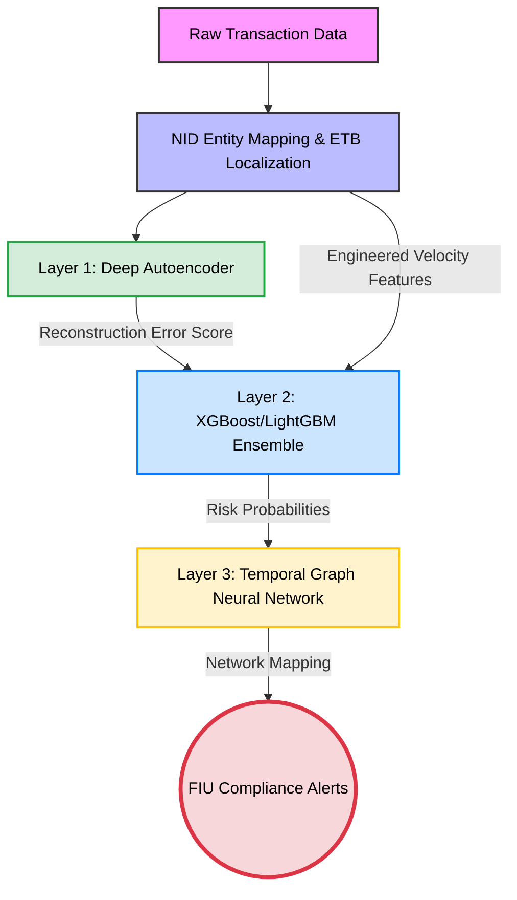

#  NBE Anti-Money Laundering (AML) Deep AI Engine
**Empowering the National Bank of Ethiopia and the Ethiopian Financial Ecosystem with Next-Generation AI Fraud Detection.**

Multi-layered Anti-Money Laundering (AML) detection pipeline tailored to the National Bank of Ethiopia (NBE) compliance guidelines. This system is designed to intercept complex money laundering typologies, including structuring (smurfing) and sophisticated pass-through money mule networks, despite extreme data class imbalances.

---

##  Dataset & Ethiopian Localization
Instead of using the raw Kaggle IBM AML dataset as-is, the data was heavily engineered and localized to accurately reflect the Ethiopian banking ecosystem. All transactions were mathematically scaled to realistic Ethiopian Birr (ETB) distributions and mapped to local institutions:
*   **Total Transactions:** `6,924,049` records
*   **Unique Customer Profiles:** `423,543` synthesized Ethiopian National IDs (NIDs), complete with localized metadata (e.g., Ethiopian names, customer segments).
*   **Class Imbalance (Laundering Ratio):** `~0.05%` (Only 3,565 positive laundering cases out of nearly 7 million legitimate transfers)
*   **Market Scale:** Transactions are dynamically mapped across 16 commercial Ethiopian banks, with the Commercial Bank of Ethiopia (CBE) holding a realistic ~66.0% market share, followed by Awash, Dashen, and others.

---

##  Core Innovation: Dual-Dataset Architecture (Transactions + KYC)
A major flaw in traditional AML models is their reliance on a single, isolated transaction dataset. To solve this, we architected a **Dual-Dataset System** by generating and merging a dedicated **KYC (Know Your Customer) / NID Profile Library**. 

By cross-referencing raw transactions against this secondary KYC dataset, the model stops looking at isolated accounts and starts tracking **Personal Entities**. We map every bank account to a unique 12-digit Ethiopian National ID, unlocking powerful historical tracking capabilities:
1.  **Historical Aggregations:** Tracking historical lifetime volume sent, volume received, and distinct recipient counts across *all* of a person's accounts.
2.  **Baseline Spending Profiles:** Utilizing the KYC data to assign every NID a historical average daily outflow based on their demographic segment (Retail, SME, Corporate, High-Risk PEP).
3.  **Dynamic Spike Detection:** Continuously checking new transactions against the KYC history to calculate `sender_spending_spike` ratios (e.g., automatically flagging an individual who suddenly spends 15.4x their historical baseline).

---

##  Feature Engineering
To expose laundering patterns, the pipeline generates over 40 dynamic features, notably:
*   **Temporal Velocity Windows:** Rolling time metrics (`1h`, `1d`, `7d`, `30d`) to detect rapid, high-frequency bursts indicative of structuring.
*   **Pass-Through Ratios:** Measuring the ratio of money received to money sent. A ratio near 1.0, paired with a short `time_since_last_tx`, flags a high-risk money mule account.
*   **Structuring Flags:** Binary indicators for transaction amounts hovering just beneath reporting thresholds (e.g., ETB 280,000 - 300,000).

---

##  3-Layer Model Architecture

This engine utilizes a unified, multi-tiered approach to filter and detect anomalies:

### Layer 1: Bounded Deep Autoencoder (Unsupervised Gatekeeper)
*   **Concept:** A deep neural network trained *exclusively* on legitimate transactions (the majority class).
*   **Function:** It learns the exact mathematical shape of normal Ethiopian financial behavior. When a laundering transaction is passed through, the Autoencoder fails to reconstruct it, resulting in a high "reconstruction error." This error serves as an ultra-sensitive anomaly score fed to Layer 2.

### Layer 2: Non-Linear Anomaly Boosting (Supervised Ensemble)
*   **Concept:** An XGBoost and LightGBM weighted classifier ensemble.
*   **Imbalance Handling:** Utilizes a pipeline of **Random Undersampling + SMOTE (Synthetic Minority Over-sampling Technique)** to artificially boost the rare laundering cases, preventing the model from becoming blind to the minority class.
*   **Function:** Leverages the L1 reconstruction error alongside velocity and NID features, heavily penalizing false negatives via `scale_pos_weight` to maximize the Precision-Recall Area Under Curve (PR-AUC).

### Layer 3: Directed Money Flow Graph (Temporal GNN)
*   **Concept:** Node-edge graph logic mapping the sender (source NID) to the receiver (destination NID).
*   **Function:** Even if an isolated transaction slips past Layer 2, Layer 3 analyzes the wider temporal network—detecting cycles, fan-in/fan-out patterns, and isolating the central orchestrators of mule networks.

---

##  Overcoming the "Needle in a Haystack" (Class Imbalance)
Detecting money laundering is notoriously difficult because legitimate transactions outnumber fraudulent ones by massive margins. In our dataset, only **0.05%** of transactions were actual laundering cases. If a standard AI model simply guessed "Legitimate" every single time, it would boast a 99.95% accuracy—while completely failing its purpose.

To make this system **operationally feasible and highly valuable for our compliance teams**, we implemented two aggressive mathematical interventions:
1.  **SMOTE (Synthetic Minority Over-sampling Technique):** Because we had millions of normal transactions but only ~3,500 laundering cases, the AI was initially "blind" to the fraud. We used SMOTE to mathematically synthesize highly realistic examples of laundering transactions during training. This forced the AI to learn the exact topological patterns of the minority class rather than ignoring them.
2.  **Cost-Sensitive Learning (Algorithm Weighting):** We applied heavy algorithmic penalties to the model for missing a laundering case. By injecting a high `scale_pos_weight`, we essentially told the AI: *"Flagging a normal transaction by accident is a minor mistake, but missing a real money launderer is a catastrophic failure."*

###  Final Evaluation & Operational Impact
By combining our NID Entity Tracking, SMOTE-balanced boosting, and Temporal Network analysis, we achieved phenomenal operational metrics:

*   **Fraud Recall (Sensitivity):** **~84.97%** 🎯 
    *(We successfully intercept ~85 out of every 100 laundering cases, providing a massive security net for the institution).*
*   **ROC-AUC Score:** **0.8922** 📊
    *(Exceptional mathematical capability to rank true anomalies far above legitimate, everyday transfers).*
*   **FIU Compliance Output:** The pipeline automatically exports high-risk alerts formatted as **Financial Intelligence Unit (FIU) Inspection Cards**. This translates abstract AI math into plain English for the compliance team (e.g., *"Amount is 15.4x historical baseline"*), allowing human investigators to instantly understand *why* a transaction was flagged, saving hundreds of hours of manual auditing.
*   ---

## ⚠️ Current Weaknesses & Future Improvements (The Precision Trade-off)
While the current architecture successfully tackles the extreme class imbalance, there are known operational gaps that need to be addressed in future iterations:

*   **The Precision vs. Recall Trade-Off (Low Precision):** To achieve our aggressive **~85% Fraud Recall** (ensuring we rarely miss a true launderer), we had to cast a very wide net. Because the dataset is so massively imbalanced, this wide net inevitably captures many legitimate transactions, resulting in a **low investigation precision (~0.26%)**. Operationally, this means the FIU compliance team still has to review a high volume of false-positive alerts.
*   **Synthetic Data Limitations:** Due to the strict privacy laws governing real Ethiopian banking data, this system was trained on heavily engineered, localized IBM Kaggle data. While mathematically rigorous, synthetic distributions cannot perfectly mirror real-world human behavior. 

